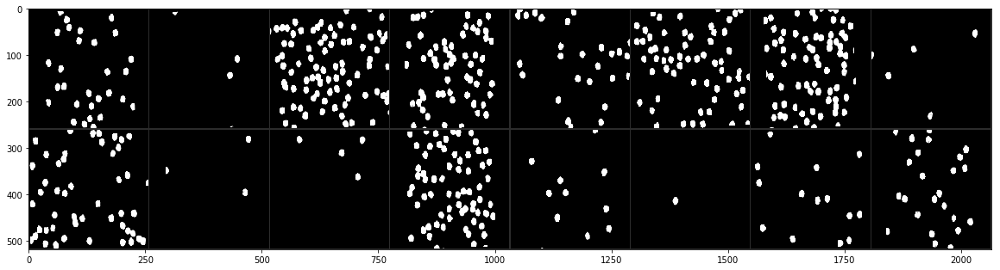
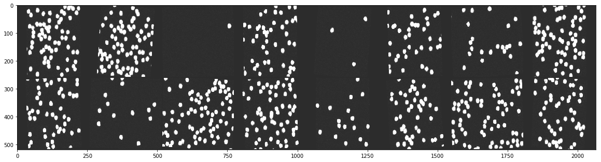
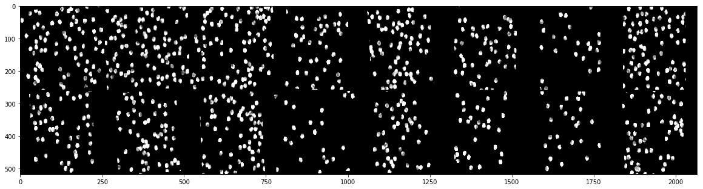
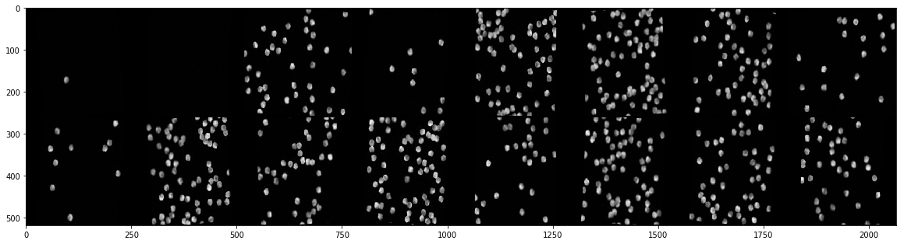

```python

```


```python
import numpy as np
import pandas as pd
import torch
import torch.nn as nn
import torch.utils.data as Data
import torchvision 
from torchvision import transforms, models, datasets
import torchvision.transforms.functional as TF
# import torchsample
import matplotlib.pyplot as plt
```


```python
means = {'A_w2': 54.14309103531166, 'A_w1': 17.385638732316533, 'H_w1': 17.17658072225906, 'H_w2': 52.40316002155172, 'P_w1': 16.87478759118037, 'P_w2': 52.54237933106764}
stds = {'A_w2': 62.598789083719836, 'A_w1': 41.12060365027215, 'H_w1': 33.58713826838851, 'H_w2': 55.52143444400337, 'P_w1': 23.851820616433884, 'P_w2': 48.37113954672323}
```

Rotate an image for a fixed degree, not randomly chosen degree from a range of degrees.


```python
def fixed_rotation(img, angle, p=.5):
    if np.random.binomial(1, p, size=1) == 1.:
        return(TF.rotate(img, angle))
    else:
        return(img)
```

All transformations on the cell counts. To see the effect of transformation on the output images after transformation, we define the transformations in a function:


```python
def transforming(mean, std, normalize=True):
    
    trans = [
            transforms.RandomHorizontalFlip(), 
            transforms.RandomVerticalFlip(),

            torchvision.transforms.Lambda(lambda img: fixed_rotation(img, 90)),
            torchvision.transforms.Lambda(lambda img: fixed_rotation(img, 180)),
            torchvision.transforms.Lambda(lambda img: fixed_rotation(img, 270)),

            torchvision.transforms.RandomRotation(5),

            transforms.Resize((256, 256)),
            torchvision.transforms.Lambda(lambda img: TF.to_grayscale(img, num_output_channels=1)),
            transforms.ToTensor()]
    if normalize:
        trans += [transforms.Normalize([means["A_w1"]/100], [stds["A_w1"]/100])]
    
    return(transforms.Compose(trans))
```

To visualize the images after transformations. We can unnormalize the images too:


```python
def imshow(img, mean, std, unnormalize):
    if unnormalize:
        img = img / std + mean    # unnormalize
    npimg = img.numpy()
    plt.figure(figsize=(20,20))
    plt.imshow(np.transpose(npimg, (1, 2, 0)))
    plt.show()
```

Here we implement the transformations and visualize:


```python
def transform_show(mean, std, normalize=True, unnormalize=True):
    
    train_trans = transforming(mean, std, normalize)

    bs = 16
    first_path = "/home/mr/SSC_case_study/train2/A/w1/"
    train_data = datasets.ImageFolder(first_path, transform=train_trans)
    data_loaders = torch.utils.data.DataLoader(train_data, batch_size=bs, shuffle=True)

    # get some random training images
    dataiter = iter(data_loaders)
    images, labels = dataiter.next()

    # show images
    imshow(torchvision.utils.make_grid(images), mean, std, unnormalize=unnormalize)
```

Comparison of images after different transformation, in four cases, whether we perform normalization and unnormalization:


```python
transform_show(mean=means["A_w1"]/100, std=stds["A_w1"]/100, normalize=True, unnormalize=True)
```

    Clipping input data to the valid range for imshow with RGB data ([0..1] for floats or [0..255] for integers).





```python
transform_show(mean=means["A_w1"]/100, std=stds["A_w1"]/100, normalize=False, unnormalize=True)
```

    Clipping input data to the valid range for imshow with RGB data ([0..1] for floats or [0..255] for integers).





```python
transform_show(mean=means["A_w1"]/100, std=stds["A_w1"]/100, normalize=True, unnormalize=False)
```

    Clipping input data to the valid range for imshow with RGB data ([0..1] for floats or [0..255] for integers).





```python
transform_show(mean=means["A_w1"]/100, std=stds["A_w1"]/100, normalize=False, unnormalize=False)
```




